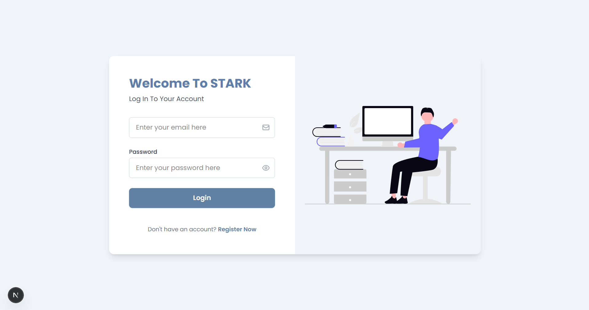
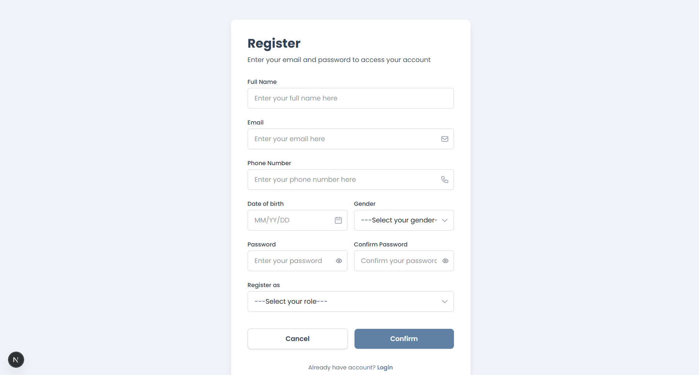
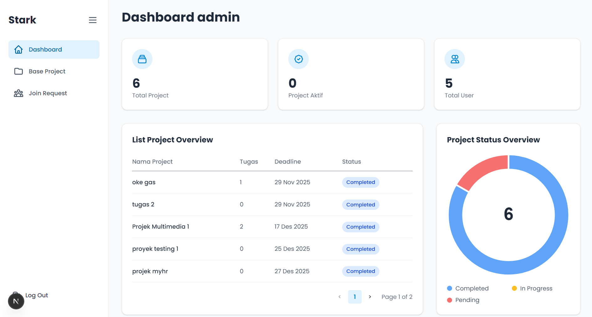
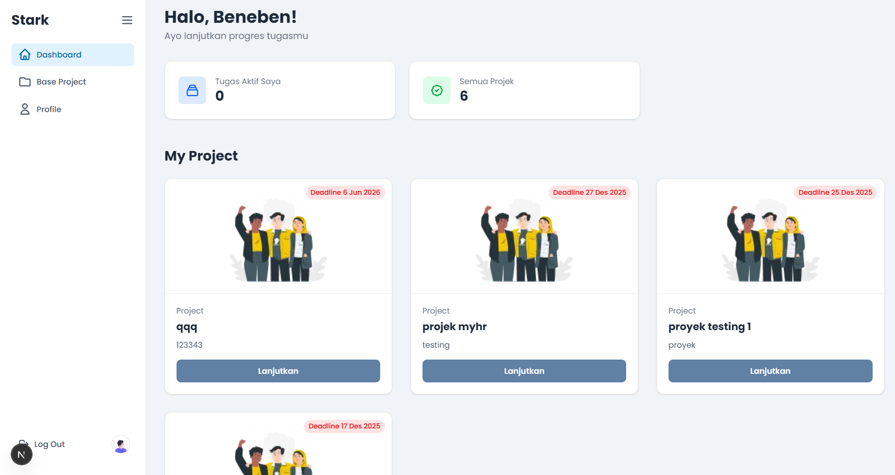
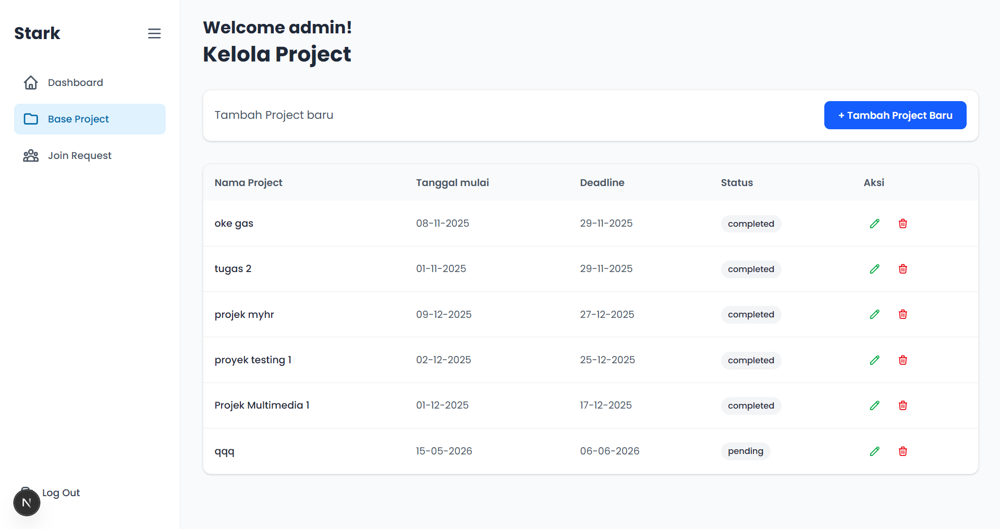
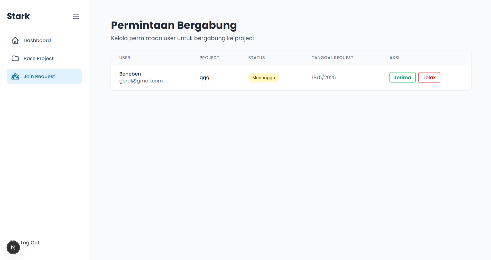
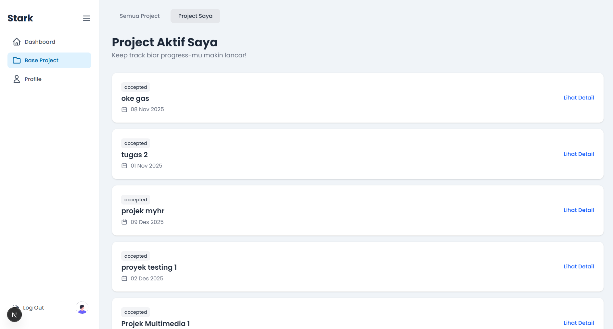
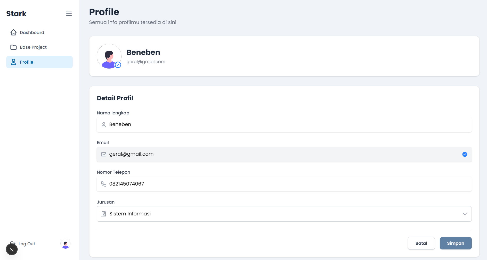

# STARK - Project Management System

**STARK** adalah aplikasi web manajemen proyek berbasis organisasi yang memungkinkan admin untuk membuat, mengelola, dan memonitor proyek beserta tugas-tugasnya, sementara member dapat mendaftar ke proyek, mengerjakan tugas, dan mengirimkan hasil kerja (submission). Sistem ini dibangun dengan arsitektur **Next.js 15** (App Router) untuk frontend dan **Express.js** (Node.js) untuk backend API, menggunakan **MySQL** sebagai database yang dikelola melalui **Sequelize ORM**. Aplikasi ini didukung oleh **Docker** untuk kemudahan deployment dan pengembangan, serta dilengkapi dengan cron job otomatis yang menandai proyek sebagai "completed" ketika melewati batas tenggat waktu.

Sistem mendukung dua peran pengguna utama: **Admin** — yang memiliki akses penuh terhadap manajemen proyek, tugas, pendaftaran anggota, dan review submission; serta **Member** — yang dapat melihat proyek yang tersedia, mendaftar, mengerjakan tugas, mengirim submission, dan melihat status progres pribadi. Autentikasi menggunakan **JWT (JSON Web Token)** dengan mekanisme access token (15 menit) dan refresh token (7 hari) yang disimpan dalam httpOnly cookie untuk keamanan.

---

## Fitur-Fitur Utama

### Untuk Admin

- **Dashboard Admin** — Ringkasan statistik (total proyek, proyek aktif, total member), grafik donut status proyek, dan tabel daftar proyek dengan paginasi
- **Manajemen Proyek (CRUD)** — Membuat, melihat, mengedit, dan menghapus proyek dengan informasi judul, deskripsi, tanggal mulai, dan tenggat waktu
- **Manajemen Tugas** — Menambahkan tugas ke dalam proyek dengan bobot nilai (1-10), tenggat waktu, dan deskripsi
- **Review Submission** — Melihat daftar submission dari member, menyetujui (approve) atau menolak (reject) dengan alasan
- **Kelola Pendaftaran** — Menerima atau menolak permintaan member yang ingin bergabung ke proyek
- **Auto-Complete Cron Job** — Proyek yang melewati `end_date` otomatis ditandai "completed" setiap tengah malam

### Untuk Member

- **Dashboard Member** — Ringkasan personal (proyek aktif, total proyek tersedia) dan daftar proyek yang diikuti
- **Jelajah & Daftar Proyek** — Melihat semua proyek tersedia dan mendaftar untuk bergabung
- **Detail Proyek & Tugas** — Melihat daftar tugas dalam proyek yang sudah diikuti
- **Submission Tugas** — Mengirim hasil kerja berupa teks atau upload file (PDF, CSV, dll.) untuk setiap tugas
- **Profil Pengguna** — Melihat dan mengedit data profil pribadi (nama, telepon)
- **Register & Login** — Mendaftar akun baru dengan role admin/member dan login dengan email/password

### Fitur Sistem

- **JWT Authentication** — Access token + Refresh token dengan auto-refresh dan blacklist saat logout
- **Soft Delete (Paranoid)** — Data tidak benar-benar dihapus dari database, hanya ditandai deleted_at
- **File Upload** — Dukungan upload file via Multer dengan batas 5 MB
- **Docker Ready** — Docker Compose untuk menjalankan seluruh stack (MySQL + API + Frontend)
- **SonarCloud Integration** — Konfigurasi analisis kode statis untuk Backend dan Frontend

---

## Instalasi dan Menjalankan Proyek

### Prasyarat

Pastikan sudah terinstal di sistem Anda:

- [Node.js](https://nodejs.org/) versi 18 atau lebih baru
- [Docker](https://www.docker.com/) dan Docker Compose
- [Git](https://git-scm.com/)

### Cara 1: Menjalankan dengan Docker (Direkomendasikan)

#### Backend (Express API + MySQL)

```bash
# Masuk ke folder Backend
cd Backend

# Jalankan MySQL dan API dengan Docker Compose
docker compose up -d

# API akan berjalan di http://localhost:4000
# MySQL tersedia di port 3307 (host) → 3306 (container)
```

#### Frontend (Next.js)

```bash
# Buka terminal baru, masuk ke folder sansa
cd sansa

# Jalankan frontend dengan Docker
docker compose up -d

# Frontend akan berjalan di http://localhost:3000
```

### Cara 2: Menjalankan Manual (Development)

#### Backend

```bash
# Masuk ke folder Backend
cd Backend

# Install dependencies
npm install

# Pastikan MySQL sudah berjalan (via XAMPP, Laragon, atau Docker)
# Sesuaikan file .env dengan koneksi database Anda

# Jalankan server dengan nodemon (hot reload)
npm run dev

# Atau jalankan tanpa nodemon
npm start

# API berjalan di http://localhost:4000
```

#### Frontend

```bash
# Buka terminal baru, masuk ke folder sansa
cd sansa

# Install dependencies
npm install

# Jalankan development server dengan Turbopack
npm run dev

# Frontend berjalan di http://localhost:3000
```

### Konfigurasi Environment

**Backend** (`.env` di folder `Backend/`):

| Variable | Deskripsi | Default |
|----------|-----------|---------|
| `DB_HOST` | Host database MySQL | `mysql` (Docker) / `localhost` |
| `DB_USER` | Username database | `root` |
| `DB_PASS` | Password database | `root` |
| `DB_NAME` | Nama database | `project_management` |
| `DB_PORT` | Port database | `3306` |
| `PORT` | Port server API | `4000` |
| `JWT_SECRET` | Secret untuk access token | (wajib diisi) |
| `JWT_REFRESH_SECRET` | Secret untuk refresh token | (wajib diisi) |

**Frontend** (`.env.local` di folder `sansa/`):

| Variable | Deskripsi | Default |
|----------|-----------|---------|
| `NEXT_PUBLIC_API_URL` | URL backend API | `http://localhost:4000` |
| `NEXT_PUBLIC_APP_NAME` | Nama aplikasi | `Sansa Project Management` |

---

## Struktur Proyek

```
Projects-Multimedia/
├── Backend/                          # Backend API (Express.js + Sequelize)
│   ├── server.js                     # Entry point: sync DB, cron job, start server
│   ├── Dockerfile                    # Docker image untuk API
│   ├── docker-compose.yml            # Docker Compose (MySQL + API)
│   ├── package.json                  # Dependencies & scripts
│   ├── wait-for-db.sh                # Script tunggu MySQL siap
│   └── src/
│       ├── app.js                    # Setup Express: routes, CORS, middleware
│       ├── config/
│       │   └── db.js                 # Konfigurasi koneksi Sequelize ke MySQL
│       ├── controllers/              # Logika bisnis per fitur
│       │   ├── authController.js     # Login, register, logout
│       │   ├── users.js              # CRUD user
│       │   ├── projects.js           # CRUD proyek + my-projects
│       │   ├── taskController.js     # CRUD tugas
│       │   ├── taskSubmissionController.js  # Submission & review tugas
│       │   ├── projectRegistrationsController.js  # Pendaftaran proyek
│       │   ├── profileController.js  # Profil user
│       │   ├── dashboardAdminController.js  # Dashboard admin
│       │   └── dashboardUserController.js   # Dashboard user
│       ├── middlewares/              # Middleware Express
│       │   ├── authMiddleware.js     # verifyToken, isAdmin, autoRefreshToken
│       │   ├── upload.js             # Konfigurasi Multer untuk upload file
│       │   └── prepareUploadMeta.js  # Metadata file upload
│       ├── models/                   # Model Sequelize (ORM)
│       │   ├── index.js              # Asosiasi & relasi antar model
│       │   ├── User.js               # Model user
│       │   ├── Project.js            # Model proyek
│       │   ├── Task.js               # Model tugas
│       │   ├── TaskSubmission.js     # Model submission tugas
│       │   └── ProjectRegistration.js # Model pendaftaran proyek
│       ├── routes/                   # Definisi rute API
│       │   ├── auth.js               # /auth/*
│       │   ├── users.js              # /users/*
│       │   ├── projects.js           # /projects/*
│       │   ├── tasks.js              # /tasks/*
│       │   ├── taskSubmissions.js    # /task-submissions/*
│       │   ├── projectRegistrations.js # /project-registrations/*
│       │   ├── profileRoutes.js      # /api/*
│       │   ├── adminRoutes.js        # /api/v1/admin/*
│       │   └── dashboardUserRoutes.js # /api/v1/dashboard-user/*
│       ├── utils/
│       │   └── blacklistToken.js     # In-memory token blacklist
│       └── uploads/tasks/            # Folder penyimpanan file upload
│
├── sansa/                            # Frontend (Next.js 15 App Router)
│   ├── Dockerfile                    # Docker image untuk frontend
│   ├── docker-compose.yml            # Docker Compose frontend
│   ├── package.json                  # Dependencies & scripts
│   ├── next.config.mjs               # Konfigurasi Next.js
│   ├── postcss.config.mjs            # Konfigurasi Tailwind CSS v4
│   ├── jsconfig.json                 # Path alias @/* → src/*
│   └── src/
│       ├── app/                      # App Router (file-based routing)
│       │   ├── layout.js             # Root layout (font, metadata)
│       │   ├── page.js               # Redirect ke /auth/login
│       │   ├── globals.css           # Tailwind + Poppins font
│       │   ├── auth/                 # Halaman publik (login, register)
│       │   │   ├── login/page.jsx
│       │   │   └── register/page.jsx
│       │   ├── admin/                # Halaman admin
│       │   │   ├── layout.jsx        # Admin sidebar layout
│       │   │   ├── dashboard/page.jsx
│       │   │   ├── base-project/     # CRUD proyek
│       │   │   │   ├── page.jsx
│       │   │   │   ├── add-project/page.jsx
│       │   │   │   └── [projectId]/
│       │   │   │       ├── edit/page.jsx
│       │   │   │       └── task/     # Manajemen tugas
│       │   │   └── join-request/     # Kelola pendaftaran
│       │   ├── user/                 # Halaman member
│       │   │   ├── layout.jsx        # User sidebar layout
│       │   │   ├── dashboard/page.jsx
│       │   │   ├── profile/page.jsx
│       │   │   └── base-project/     # Jelajah & detail proyek
│       │   │       └── [projectId]/detail/
│       │   │           └── submission/page.jsx
│       │   └── store/                # Zustand state management
│       ├── components/               # Komponen React
│       │   ├── admin/                # Komponen admin
│       │   ├── auth/                 # Form login & register
│       │   ├── user/                 # Komponen member
│       │   ├── dashboard/            # Sidebar, stat card, project card
│       │   ├── baseproject/          # Kartu proyek untuk jelajah
│       │   ├── myproject/            # Kartu proyek yang diikuti
│       │   └── ui/                   # Komponen reusable (Input, Button)
│       ├── lib/                      # Konfigurasi axios & API helpers
│       │   ├── axiosInstance.js      # Axios instance (admin)
│       │   └── api.js                # Axios instance + interceptor (user)
│       └── data/                     # Mock data (development)
│
├── screenshots/                      # Tangkapan layar aplikasi
│
├── sonar-project.properties          # Konfigurasi SonarCloud
└── REFACTORING_GUIDE.md              # Panduan refactoring frontend
```

---

## Tangkapan Layar (Screenshots)

### Halaman Login


### Halaman Register


### Dashboard Admin


### Dashboard Member


### Tambah Proyek (Admin)


### Kelola Pendaftaran (Admin)


### Proyek Saya (Member)


### Profil Pengguna


---

## Tech Stack

| Layer | Teknologi |
|-------|-----------|
| **Frontend Framework** | Next.js 15.5 (App Router) |
| **Frontend Library** | React 19.1 |
| **Styling** | Tailwind CSS v4, MUI Material, Emotion |
| **State Management** | Zustand v5 |
| **HTTP Client** | Axios |
| **Charts** | Chart.js + react-chartjs-2 |
| **Validation** | Zod v4 |
| **Backend Framework** | Express.js 5.1 |
| **ORM** | Sequelize 6.37 |
| **Database** | MySQL 8.0 |
| **Authentication** | JWT (jsonwebtoken) + bcrypt |
| **File Upload** | Multer 2.0 |
| **Scheduler** | node-cron |
| **Containerization** | Docker + Docker Compose |
| **Code Quality** | SonarCloud |
